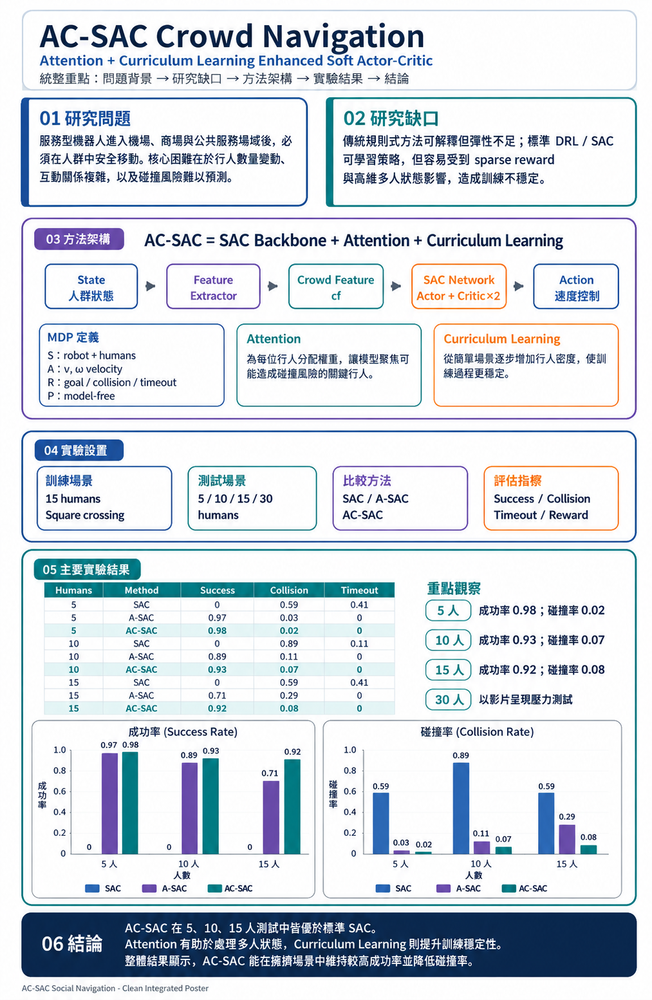
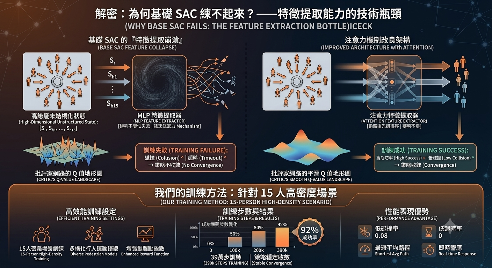

<div align="center">

## 🎬 Demo 影片

[](https://www.youtube.com/watch?v=MLkryevYdXw&feature=youtu.be)

**▶ 點擊觀看 AC-SAC 社交導航 Demo 影片**

</div>

---

<div align="center">

# 🤖 AC-SAC：基於注意力機制與課程學習強化的深度強化學習社交導航

### Attention-Curriculum Soft Actor-Critic for Social Robot Navigation

**提升複雜社交場景下的機器人導航成功率**

[](https://www.youtube.com/watch?v=MLkryevYdXw&feature=youtu.be)
[](https://github.com)
[](https://python.org)

---

> **Group 21** ｜ 郭乃文 (7114093001)・方芯芸 (7114064002)・李宗穆 (7114093009)・林奇和 (7114064165)

</div>

---

## 📌 目錄

- [專案概覽](#-專案概覽)
- [緒論：問題背景](#-緒論問題背景)
- [現有系統的瓶頸](#-現有系統的兩大瓶頸)
- [相關研究](#-相關研究導航技術流派演進)
- [系統方法](#-系統方法)
- [實驗設置](#-實驗設置與評估指標)
- [實驗結果](#-實驗結果)

---

## 🗺️ 專案概覽

<div align="center">



</div>

---

## 🌐 緒論：問題背景

服務型機器人正大規模進入餐廳、機場等公共場所，**導航任務**需同時兼顧：

| 面向 | 說明 |
|------|------|
| 🛡️ **安全性** | 避免與人碰撞，維護人身安全 |
| ⚡ **效率** | 在合理時間內完成任務 |
| 🤝 **社交合規** | 遵守人類社交規範（personal space 等） |

### 📊 領域現況

- 已累積 **4,427 條軌跡** 與 **4,402 筆**人工評分樣本，進入系統化訓練與嚴謹比較階段
- 基準測試顯示，在擁擠場景中，優秀的學習式導航具備提升 **38.3%** 成功率與 **46% 社交合規性**的潛力

---

## ⚠️ 現有系統的兩大瓶頸

<div align="center">



</div>

### 🧊 瓶頸一：機器人凍結（Freezing Robot）

傳統基於規則的演算法在密集動態人群中過於保守，頻繁找不到可行解，導致**機器人停滯或任務超時**。

### 🕳️ 瓶頸二：學習陷阱（Learning Trap）

深度強化學習（DRL）在處理高維度動態特徵時，極易在訓練初期掉入**局部最佳解**，導致收斂困難與泛化性低。

---

## 🔬 相關研究：導航技術流派演進

### 技術維度綜合對比

| 方法 | 處理動態高維特徵 | 避免局部最佳解 | 軌跡平滑連續控制 | 收斂速度 |
|------|:-:|:-:|:-:|:-:|
| Rule-based (ORCA/SFM) | ❌ | ❌ | ➖ | ✅ |
| Standard DRL (Vanilla SAC) | ➖ | ❌ | ➖ | ➖ |
| Single Attention (SARL) | ✅ | ➖ | ✅ | ❌ |
| **AC-SAC（本研究）** | ✅ | ✅ | ✅ | ✅ |

> **核心結論：** 整合注意力機制（Attention）與課程學習（Curriculum Learning）的 SAC 架構，能全面突破現有技術的天花板。

---

## 🏗️ 系統方法

### MDP 基礎問題定義

社交導航問題被形式化為 Markov Decision Process（MDP）：

- **狀態空間 S：** 機器人狀態 + 動態行人觀測（包含數量變動、高維度特徵）
- **動作空間 A：** 連續控制輸出（線速度與角速度）
- **獎勵函數 R：** 抵達目標(+)、碰撞(-)、維持社交距離(+)、時間懲罰(-)
- **轉移機率 P：** 行人意圖難測，屬未知且高動態的轉移（Model-free）

---

### AC-SAC 核心架構

AC-SAC 採用模組化設計，包含三個核心元件：

```
Environment → Feature Extractor (Crowd Feature) → SAC Network
                                                   ├── Actor
                                                   ├── Critic 1
                                                   └── Critic 2
```

**網路目標：** 最大化 Expected Cumulative Reward 與 Policy Entropy。

---

### 兩大核心機制突破

#### 1. 🔍 注意力機制（Attention Mechanism）— 找出關鍵行人

> 動態計算周圍每個行人對機器人的**相對重要性**

- **機制：** 透過 Attention Lens，對每個行人計算注意力權重
- **成效：** 賦予潛在碰撞風險較高的目標更大權重，徹底解決**高維度**與**數量變動狀態**的處理難題

#### 2. 📈 課程學習（Curriculum Learning）— 穩定訓練收斂

> 透過 Reward Shaping 與**階梯式難度設計**，從簡單場景逐步提升

```
簡單場景（靜態/少量行人）  →  中階難度  →  高階擁擠
```

- **機制：** 提供更密集的訓練回饋（Denser feedback）
- **成效：** 有效避開盲目探索導致的學習陷阱，確保策略穩健收斂

---

## 🧪 實驗設置與評估指標

### 測試環境

- 分別在 **5 人、10 人、15 人、30 人** 的動態人群導航環境中進行壓力測試
- 測試條件：每個模型評估 **100 個 Episodes**

### 比較基準（Ablation Baselines）

| 模型 | 說明 |
|------|------|
| **SAC** | 標準 Soft Actor-Critic |
| **A-SAC** | 僅加入 Attention 機制的 SAC |
| **AC-SAC** | 本文提出的完整架構（Attention + Curriculum Learning）|

### 評估指標

| 指標 | 說明 |
|------|------|
| ✅ Success Rate | 成功率 |
| 💥 Collision Rate | 碰撞率 |
| ⏰ Timeout Rate | 超時率 |
| 📏 Avg Path Length | 平均路徑長度 |
| 🏆 Avg Reward | 平均獎勵 |

---

## 📈 實驗結果

### Human = 5

| Model | 成功率 | 碰撞率 | 超時率 | 平均長度 | 平均獎勵 |
|-------|:------:|:------:|:------:|:--------:|:--------:|
| SAC | 0% | 0.59 | 0.41 | 0 | -0.43 |
| A-SAC | 97% | 0.03 | 0 | 10.00 | 0.94 |
| **AC-SAC** | **98%** | **0.02** | **0** | **11.23** | **0.94** |

### Human = 10

| Model | 成功率 | 碰撞率 | 超時率 | 平均長度 | 平均獎勵 |
|-------|:------:|:------:|:------:|:--------:|:--------:|
| SAC | 0% | 0.89 | 0.11 | 0 | -0.53 |
| A-SAC | 89% | 0.11 | 0 | 11.29 | 0.80 |
| **AC-SAC** | **93%** | **0.07** | **0** | **12.17** | **0.85** |

### Human = 15

| Model | 成功率 | 碰撞率 | 超時率 | 平均長度 | 平均獎勵 |
|-------|:------:|:------:|:------:|:--------:|:--------:|
| SAC | 0% | 0.59 | 0.41 | 0 | -0.43 |
| A-SAC | 71% | 0.29 | 0 | 12.53 | 0.51 |
| **AC-SAC** | **92%** | **0.08** | **0** | **13.31** | **0.82** |

> 🏆 **AC-SAC 在所有密度場景中均取得最佳表現，尤其在高密度（15人）場景成功率仍維持 92%，遠超基準方法。**

---

<div align="center">

**Made with ❤️ by Group 21 | Deep Reinforcement Learning Course**

</div>
